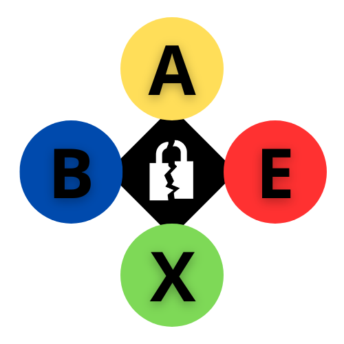

# Automatic BadUpdate Executer for Xbox 360 (ABEX)

  
  
ABEX is a way to automate the exploit performed by BadUpdate on the Xbox 360. It uses an ESP32-WROOM as a microcontroller to perform the automation, it also uses NPN transistors and   a USB Controller, there is also a buzzer for indication but it is optional. It can identify information through the RCA input the music of Rock Band Blitz and the connection status of the   controller, which is done by checking the controller's LED using its voltage.
The code works, but I plan to make code or logic improvements in the future.
On my youtube channel I will publish some tests: https://youtube.com/@ivnlsc

#Components used:

-Esp32-WROOM-32 -> Microcontroller
-2x 9018 NPN transistor -> Short button pins
-2x 13001B NPN transistor -> Power controller and power Xbox
-2x 100kΩ transistor -> For RCA audio signal
-1uf capacitor -> RCA audio signal
-4x 1kΩ resistor -> Base pin of transistors
-Passive buzzer -> Sound alert
-Usb Xbox360 controller -> I just used the board to make it more compact,can also be adapted for wireless control.

